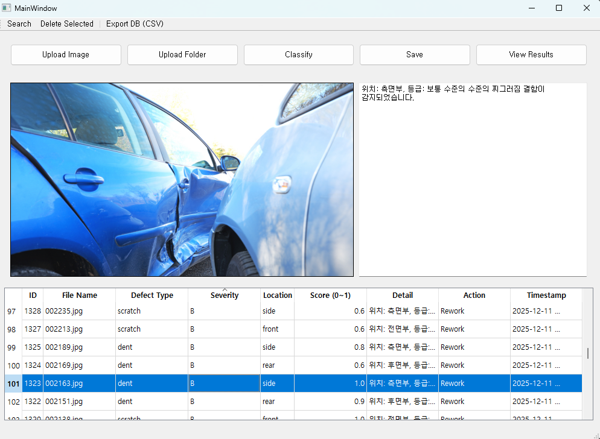
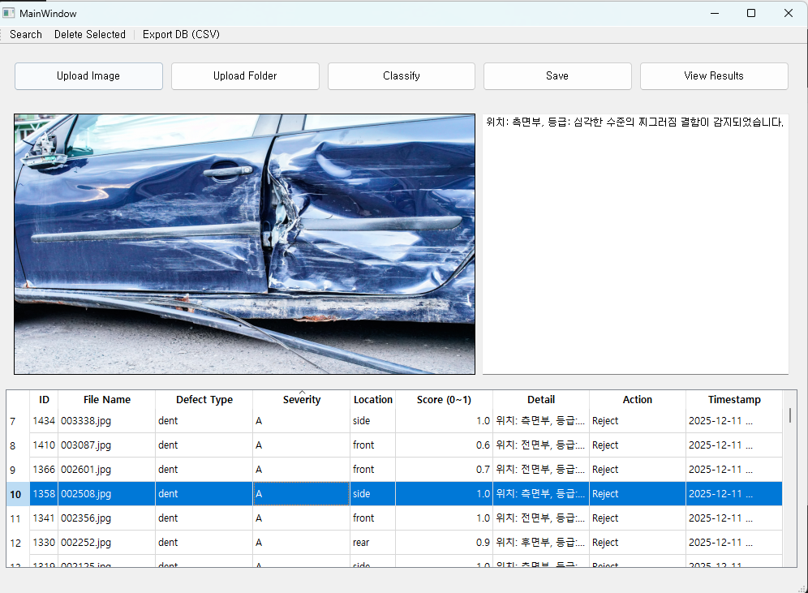
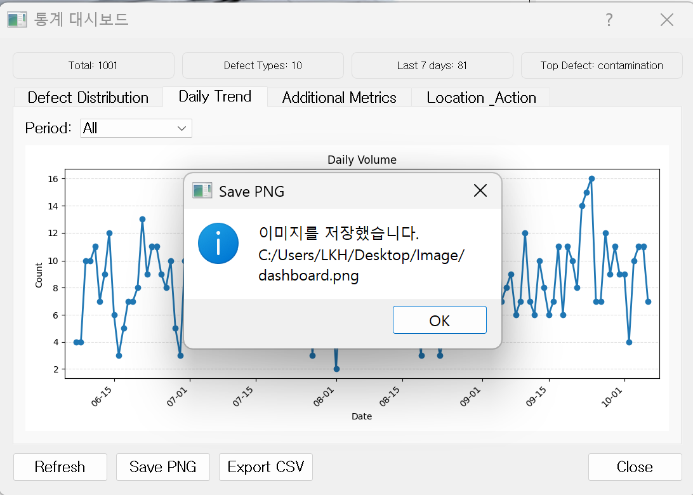

# 🚗 자동차 불량 분류 보조 시스템 (VisionQC Local AI Edition)

이 프로젝트는 자동차 외장 이미지를 **로컬 머신에서 직접 AI 모델로 분석**하고, **PyQt5 기반 GUI**를 통해 불량 정보를 편리하게 조회·관리할 수 있는 **오프라인 품질 관리 보조 시스템**입니다.

기존 VisionQC가 OpenAI Vision API를 사용했던 것과 달리, VisionQC-Local-AI는 모든 분류 작업을 자체 학습한 PyTorch 모델로 수행합니다.

---

## 🎯 목표
OpenAI Vision API 대신 ResNet34 Multi-task Classification Model(.pth) 로 불량 정보를 추론합니다.

---
## 🔍 커스텀 AI 모델 구성 (ResNet34 Multi-Task Classifier)

VisionQC-Local-AI는 OpenAI Vision API 대신, 직접 학습한 ResNet34 기반 멀티태스크 분류 모델을 사용합니다.

모델은 한 번의 이미지 입력으로 다음 세 가지 정보를 동시에 예측합니다:

- 불량 유형 (7-class)
- 심각도 (High / Medium / Low)
- 위치 (front / rear / side 등)

---

### 모델 구조 요약
- Backbone: ResNet34 (ImageNet pretrained)
- Feature dimension: 512
- Classification heads:
  - Defect type head: 512 → 6
  - Severity head: 512 → 3
  - Location head: 512 → 3
- Softmax 기반 multi-task classification
- WeightedRandomSampler 사용 → 학습 데이터 편중 문제 보완
- Stochastic Gradient Descent optimizer 사용 → 파인 튜닝에서 Adam 보다 안정적

- Combined loss:
  total_loss = 1.0 * loss_defect + 0.7 * loss_severity + 0.7 * loss_location

---

### 특징
- 하나의 모델로 모든 정보를 동시에 예측
- 모델 크기가 작아 CPU 환경에서도 빠르게 동작
- 완전 로컬 모델로, 네트워크 연결 없이도 분석 가능

---

## ⚡ GPT Vision API 대비 속도 우위

기존 VisionQC(OpenAI Vision 기반)는 아래와 같은 한계가 있었습니다:

- 이미지 base64 인코딩 및 prompt 생성 필요
- OpenAI 서버로 요청 전송 → 1~2초 지연
- 인터넷 연결 필수
- API 비용 발생
- 응답 형식이 자연어 기반이라 변동성 존재

VisionQC-Local-AI는 이러한 문제를 모두 해결합니다.

---

### 로컬 AI 모델의 장점

- **압도적으로 빠른 속도**
  - GPT Vision API: 1.0 ~ 2.5초
  - Local AI (ResNet34): 0.03 ~ 0.12초 (CPU 기준)

- **완전 오프라인 동작**
  - 인터넷 필요 없음
  - 보안 민감 데이터 유출 위험 없음

- **비용 0원**
  - API 호출 비용 없음
  - 요청 제한 없음

- **일관된 출력**
  - GPT의 자연어 기반 결과 변동성 제거
  - 항상 동일 구조의 결과(JSON-like) 제공

- **대량 이미지 QC에 최적화**
  - API rate limit 없음
  - 실시간 품질 검사 자동화에 적합

---

## 🔧 커스텀 AI 모델 학습 방식 — 2단계 파인튜닝 전략

자동차 외장 불량 데이터는 클래스 간 불균형이 존재하고, 전체 데이터 규모가 대형 데이터셋에 비해 상대적으로 적습니다.  
이를 보완하기 위해 VisionQC-Local-AI는 **2단계 파인튜닝(2-Phase Fine-Tuning)** 전략을 사용하여 안정적이고 높은 성능을 확보했습니다.

---

### **📌 Phase 1 — 상단 FC 레이어만 학습 (Feature Extractor Freeze)**

- ResNet34의 모든 convolutional layer를 **freeze**  
- 마지막 Fully-Connected Layer(FC Head)만 학습  
- 학습률(LR)이 상대적으로 높은 값 사용  
- 목적:  
  - 빠른 수렴  
  - 분류 head를 데이터 분포에 맞게 먼저 적응  
  - 과적합 위험 감소  
  - 작은 데이터에서도 안정적 초기 성능 확보  

**효과:**  
백본 가중치를 보존하면서, 작은 데이터에서도 빠르고 안정적인 초기 성능을 얻을 수 있음.

---

### **📌 Phase 2 — 상위 Block(layer4) + FC 레이어 미세조정 (Fine-Tuning)**

- ResNet34 중 **layer4 + FC head만 unfreeze**  
- 다른 레이어는 계속 freeze  
- 더 작은 learning rate 사용  
- CosineAnnealing 스케줄 적용  
- 목적:  
  - 보다 세밀한 feature adaptation  
  - 불량 패턴(스크래치, 크랙, 찌그러짐 등)의 미묘한 차이를 백본 수준에서 반영  
  - 과적합을 피하면서 정밀도 향상
- Early Stopping (patience = 3)으로 과학습 방지

**효과:**  
클래스 간 차이가 미묘한 자동차 외장 불량 이미지에서  
모델이 실제 특징을 더 잘 구분하도록 성능이 향상됨.

---

### **🎯 왜 2단계 파인튜닝인가?**

자동차 외장 불량 데이터의 특성:

- 데이터 양이 제한적  
- 클래스 간 불균형 존재  
- 촬영 각도 다양  
- 라벨 품질이 완벽하지 않음  
- 6-class defect + 3-class severity + 3-class location → **멀티태스크 구조**

이런 조건에서 전 레이어를 한 번에 학습하면:

- 과적합 위험 증가  
- 불안정한 gradient  
- 초기 학습 폭주 발생  
- 성능 흔들림 가능성 큼

따라서 **백본을 단계적으로 풀어주는 2단계 파인튜닝 방식**이 가장 합리적이며,  
실제 학습에서도 성능·안정성이 크게 향상됨.

---

### **📈 학습 결과**

2단계 학습 전략 + Sampler 적용으로 다음 효과가 확인됨:

- defect classification 정확도 향상  
- severity / location 분류 안정성 증가  
- 추론 결과 편차 감소  
- 로컬 환경에서도 높은 신뢰도로 QC 보조 가능

---

### ✔ 요약

VisionQC-Local-AI 모델은 적은 데이터에서도 최대 성능을 끌어내기 위해  
**ResNet34 기반 멀티태스크 모델 + 2단계 파인튜닝 전략**을 적용하였으며,

이는 기존 단일 단계 학습보다  
- 더 안정적이며  
- 더 높은 정확도와  
- 더 낮은 분산을 갖는 모델을 만들 수 있게 합니다.

---

## 📂 데이터셋 출처

본 프로젝트에서는 **CarDD (Car Damage Dataset)** 를 활용하여 local ai 모델을 학습시키고 적용했습니다.

CarDD는 차량 외장 손상 이미지 약 4,000장을 포함하고 있으며, 스크래치, 찌그러짐, 균열, 변색, 오염 등 다양한 불량 유형을 포함합니다.

- [CarDD 공식 페이지](https://cardd-ustc.github.io/?utm_source=chatgpt.com)

---

## 🔁 전체 흐름

1. 이미지 업로드
2. 프롬프트(분류 요청) 전달
3. local ai model을 통한 불량 유형 분류/설명
4. 결과 출력 및 SQLite DB 저장
5. 검색 기능으로 불량 유형/날짜별 탐색
6. 데이터 시각화

---

## 📸 실행 화면 (Execution Screenshots)

### 🖥️ 메인 화면
이미지 업로드 → AI 모델로 분류 → DB 저장 → 결과 표시



---

### 📊 통계 대시보드 (Stats Dashboard)

#### 1️⃣ Defect Distribution
심각도(Severity)별 결함 발생 빈도를 나타내는 스택형 바 차트  


#### 2️⃣ Daily Trend
일자별 불량 발생 추이를 보여주는 라인 차트  


#### 3️⃣ Additional Metrics
- Defect Type Ratio (Top10)  
- Severity Ratio (A/B/C)


#### 4️⃣ Location & Action
위치별 결함 분포 및 조치(Action) 비율 시각화  


---

### 💾 Export 기능
그래프 저장 및 CSV 내보내기 기능이 구현되어 있습니다.

| 기능 | 설명 | 예시 |
|------|------|------|
| **Save PNG** | 대시보드 이미지를 파일로 저장 |  |
| **Export CSV** | 그래프별 데이터를 CSV 파일로 내보내기 |  |

---

## 🔧 시스템 구성도
```text
[ 사용자 ]
   ↓
[ PyQt5 GUI ]
   ↓                ↘
[ 이미지 업로드 + 프롬프트 ]   [ 검색 질의 ]
   ↓                          ↘
[ local ai API 호출 ]      [ SQLite DB ]
   ↓                          ↗
[ 불량 유형 분류 + 설명 출력 ]
   ↓
[ 결과 DB 저장 및 화면 표시 ]
   ↓
[ 데이터 시각화 ]
```
---

## 📁 디렉토리 구조
```text
visionqc-local-ai/
├── gui/
│   └── __init__.py
│   └── main_app.py
│   └── main_window.py
│   └── stats_view.py
├── api/
│   └── __init__.py
│   └── local_ai_api.py
├─ assets/
├── data/                    # (Not included in the repo)
│   └── CarDD_COCO/
│       ├── annotations/
│       ├── train2017/
│       ├── val2017/
│       └── test2017/
├── db/
│   └── __init__.py
│   └── db.py
├── models/
│   └── visionqc_multitask_resnet34_best.pth
├── notebooks/
│   └── 01_train_multitask_model.ipynb
│   └── 02_test_evaluation.ipynb
├── utils/
│   └── __init__.py
│   └── config.py
│   └── file_handler.py
├── main.py
├── app.db # (Not included in the repo)
├── .env
└── requirements.txt
```

---

## 📦 requirements.txt
```text
# ----- Core (CPU PyTorch) -----
torch==2.2.2
torchvision==0.17.2
typing_extensions>=4.8.0

# ----- GUI -----
PyQt5>=5.15.10

# ----- Image / Data -----
Pillow>=10.0.1
numpy>=1.26.0,<2.0.0
pandas>=2.1.0

# ----- Utilities -----
tqdm>=4.66.0
matplotlib>=3.8.0

# ----- Config -----
python-dotenv>=1.0.0
```

---

## 🚀 실행 방법 (Quickstart)

```bash
git clone https://github.com/mavro7910/visionqc-local-ai
cd visionqc-local-ai
```
```bash
# 새 가상환경 생성
python -m venv .venv
```
```bash
# 가상환경 활성화
.venv\Scripts\activate
```

```bash
# 필요한 패키지 설치
pip install -U pip setuptools wheel  # ERROR: To modify pip, please run the following command: 에러 발생 시 에러 내용 하단 명령어로 재설치
pip install -r requirements.txt
```

```bash
# 실행
python main.py
```

---

## 👨‍💻 개발자
**이광호 (Kwangho Lee)**  
성균관대학교 기계공학부  

- GitHub: [@mavro7910](https://github.com/mavro7910)  
- Email: [kwangho97@g.skku.edu]

---

## 📜 License
이 프로젝트는 [MIT License](./LICENSE)를 따릅니다.

---